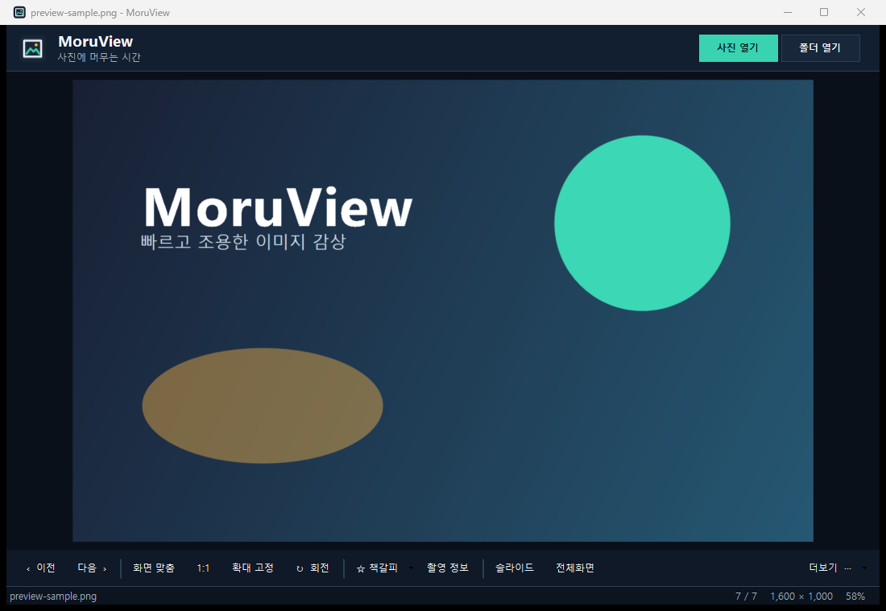

# MoruView

**빠르고 조용한 Windows 이미지 감상**

MoruView는 광고와 회원가입 없이 PC에서만 동작하는 가벼운 이미지 뷰어입니다.
고해상도 이미지와 대형 GIF를 빠르게 표시하며, 압축파일을 풀지 않고 내부 이미지를
바로 넘겨볼 수 있습니다.

> Developed by **Ryui93**  
> Copyright © 2026 Ryui93. All rights reserved.

## 주요 기능

- JPG, PNG, GIF, WebP, AVIF, HEIC/HEIF, BMP, TIFF, ICO, TGA, DDS, QOI 지원
- ZIP, 7Z, RAR, CBZ, CBR, CB7, TAR 내부 이미지 바로 보기
- 고해상도 이미지 빠른 디코딩과 다음 이미지 미리 읽기
- 대형 GIF 첫 화면 즉시 표시 및 애니메이션 재생
- 확대·축소, 화면 맞춤, 확대율 고정, 회전, 전체화면, 슬라이드쇼
- 방향키 및 PageUp·PageDown 이미지 탐색
- 압축파일 내부 위치까지 기억하는 영구 책갈피
- 우클릭 회전·반전·복사·편집본 저장·그림판 연동
- 백틱(`) 키로 상단 메뉴 트레이 표시·숨김
- Windows 기본 이미지 앱 등록 지원
- 광고, 계정, 원격 전송, 인터넷 연결 없음

## 설치

1. [Releases](../../releases)에서 `MoruView-Setup.exe`를 내려받습니다.
2. 실행 중인 이전 MoruView를 종료합니다.
3. 설치파일을 실행합니다. 기존 설치가 있으면 같은 위치에 업데이트됩니다.
4. 설치 후 열리는 Windows 기본 앱 설정에서 원하는 확장자를 MoruView로 지정합니다.

개인 제작 앱이라 코드 서명이 적용되지 않았습니다. Windows SmartScreen이 표시되면
파일 출처와 체크섬을 확인한 뒤 `추가 정보 → 실행`을 선택하세요.

## 주요 단축키

| 키 | 기능 |
|---|---|
| `←`·`↑` / `→`·`↓` | 이전 / 다음 이미지 |
| `PageUp` / `PageDown` | 이전 / 다음 이미지 |
| 마우스 휠, `+` / `-` | 확대 / 축소 |
| `F` | 화면 맞춤 |
| `0` | 100% 보기 |
| `R` | 오른쪽 회전 |
| `Ctrl+B` | 책갈피 추가 / 제거 |
| `B` | 책갈피 목록 |
| `` ` `` | 상단 메뉴 표시 / 숨기기 |
| `F11`, `Alt+Enter` | 전체화면 |
| `Ctrl+O` | 파일 열기 |

## 시스템 요구사항

- Windows 10/11 x64
- .NET Framework 4.8 이상

## 알려진 제한

- 암호화된 압축파일은 지원하지 않습니다.
- Windows 정책상 기본 앱 지정은 설정 화면에서 사용자가 직접 선택해야 합니다.

## 저작권

Copyright © 2026 Ryui93. All rights reserved.  
별도 허가 없이 프로그램 또는 제작자 정보를 변조해 재배포할 수 없습니다.
